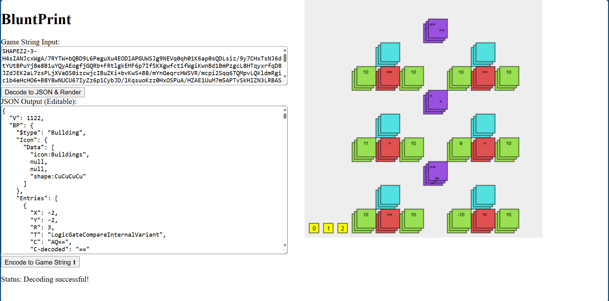

# BluntPrint

This program provides a visual interface for editing Blueprints from the game Shapez 2.

With BluntPrint, you can easily:

*   Copy and paste machines or entire islands directly from the game into the editor.
*   Open and load existing blueprint files into the UI. (Planned feature)
*   View and modify the blueprint's JSON representation.
*   Edit base64 encoded values using a decoded string representation, with automatic conversion handled by the program.

BluntPrint simplifies the process of modifying Shapez 2 blueprints, allowing for easy experimentation and customization.

