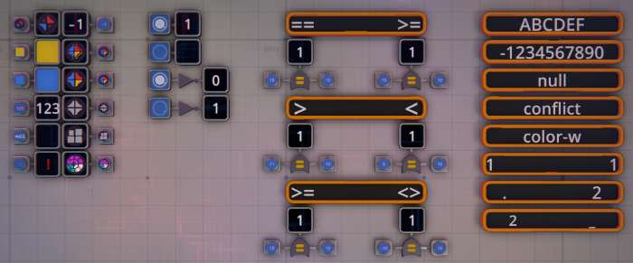
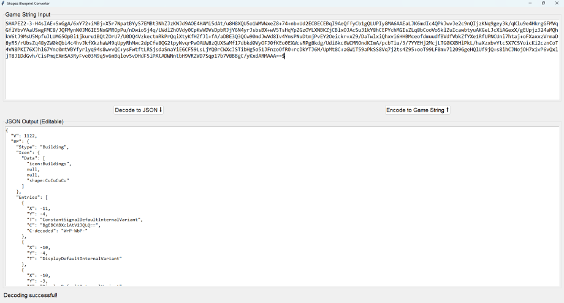

# BluntPrint

This program let's you edit BluePrints from the game Shapez 2

Experiment copying machines or islands from the game and pasting on the UI. You can also open a blueprint file and paste its content on the UI.

A resulting JSON will be shown and you can make modifications an convert back to the game format and load back in the game.

If a value from the JSON is encoded in base64, you will have a "C-decoded" string that you can edit and let the program convert using the game logic.

This is a work in progress, more features will be implemented on demand.

Some machines may not be supported yet because I only played the game in normal mode and didn't unlock all machines.

EXAMPLE
=======





```
SHAPEZ2-3-H4sIAE+SxGgA/6xY72+iMBj+X5r7NpatBYyS7EMBt3NhZJzKNJd9AOE4HAMi5dAt/u8H8XQU5o1WMVWxeZ8+74+nb+Ud2ECBECEBqI9AeQffyCb1gQLUPIy8MA6AAEaLJK6mdIc4QPkJwvJe2c9nQIjzKNq9gey3k/qKlu9e4HkrgGFMVqGflYbvYAaUSwgFMC8/JQFMynW0JM6IE5NxGMROpPu/nDwio5j4q/LWdlZhOVdy0CpKwVDVsDpbRJjY6N4yrJsbsBX+wV5TsHqYpZGzOYLXNBKZjCBlxOJAcSu31kY8hCEPYchMGIsZLq8bCooVo5klZuIcawbtyuAKGeLJcXiAGexX/gEUpjz324aMQhkV6tJ9MsU5MpfuJLUMG5OpBi1jkuru1BQtZOrU7/U0DQ4VzkectmRkPrQqiXtyKfHZfJl+fA/aDBE3Q3QCw90mdJwVd8Iv4YmsPNuDtmjPvEY2Oeickr+xZ9/DaTwlxiQhxvi6HHBMceofdmuudfBVdfVbkZfYXe1RfUPNCUni7htaj+oFXaxxzVrmaD8yR5/rUbsZq48yZW0kQbi4c4hvJkfXkzhaW49qUpyRhMwc2dpCfe8QG2tpyWvqrPwOAUW8zQUXSaMf17dbkd0VyOFJ0fKEo0EXWcsRPg8kdg/Udi6kc6WCMROndKImA/pcbTiu/3/7YYEHj2McjLTG0KXBHlPkL/haXzxbvYtc5X7CSYoicKi2cznCoT4VN8PKI76XJhlG7Ync0mtVBYfyrlyq94s8wvvQC+ysFwtftLRSjsdaSnaYiEGCF59LsLjYQ0rCWXcJSTibHg5o51JFnzoOfR0+rcDkYTJ6M/UpMt8C+aGWiT59aPkSS8Vq7j2ts4Z95+ooT99LF8mv7l209GgeHQlUf9jQ+s8ihCJNojOH7xivP6vQxljT8J1DdGvh/CisPmqEXmSA3RyFve03M9q5v6mBqlov5vDHdF5iPAtADWNntbH9VRZWD7Sqp17b7V8BBgC/yKxdARMAAA==$
```

```
{
  "V": 1122,
  "BP": {
    "$type": "Building",
    "Icon": {
      "Data": [
        "icon:Buildings",
        null,
        null,
        "shape:CuCuCuCu"
      ]
    },
    "Entries": [
      {
        "X": -11,
        "Y": -4,
        "T": "ConstantSignalDefaultInternalVariant",
        "C": "BgEBCABXclAtV2JQLQ==",
        "C-decoded": "WrP-WbP-"
      },
      {
        "X": -10,
        "Y": -4,
        "T": "DisplayDefaultInternalVariant"
      },
      {
        "X": -10,
        "Y": -3,
        "T": "DisplayDefaultInternalVariant"
      },
      {
        "X": -11,
        "Y": -3,
        "T": "ConstantSignalDefaultInternalVariant",
        "C": "BwF5",
        "C-decoded": "y"
      },
      {
        "X": -10,
        "Y": -2,
        "T": "DisplayDefaultInternalVariant"
      },
      {
        "X": -10,
        "Y": -1,
        "T": "DisplayDefaultInternalVariant"
      },
      {
        "X": -11,
        "Y": -1,
        "T": "ConstantSignalDefaultInternalVariant",
        "C": "A3sAAAA=",
        "C-decoded": "123"
      },
      {
        "X": -11,
        "T": "ConstantSignalDefaultInternalVariant",
        "C": "AQ==",
        "C-decoded": "null"
      },
      {
        "X": -10,
        "T": "DisplayDefaultInternalVariant"
      },
      {
        "X": -11,
        "Y": 1,
        "T": "ConstantSignalDefaultInternalVariant",
        "C": "Ag==",
        "C-decoded": "conflict"
      },
      {
        "X": -10,
        "Y": 1,
        "T": "DisplayDefaultInternalVariant"
      },
      {
        "X": -11,
        "Y": -2,
        "T": "ConstantSignalDefaultInternalVariant",
        "C": "BwFi",
        "C-decoded": "b"
      },
      {
        "X": -9,
        "Y": 1,
        "R": 2,
        "T": "DisplayDefaultInternalVariant"
      },
      {
        "X": -8,
        "Y": 1,
        "R": 2,
        "T": "ConstantSignalDefaultInternalVariant",
        "C": "BgEBIwBjbWN3Y2NjbTpQLVAtUC1QLTpDbUN3Q2NDbTpQLVAtUC1QLQ==",
        "C-decoded": "cmcwcccm:P-P-P-P-:CmCwCcCm:P-P-P-P-"
      },
      {
        "X": -9,
        "Y": -3,
        "R": 2,
        "T": "DisplayDefaultInternalVariant"
      },
      {
        "X": -8,
        "Y": -3,
        "R": 2,
        "T": "ConstantSignalDefaultInternalVariant",
        "C": "BgEBEQBXcld5V2JXYjpXcld5V2JXYg==",
        "C-decoded": "WrWyWbWb:WrWyWbWb"
      },
      {
        "X": -9,
        "Y": -2,
        "R": 2,
        "T": "DisplayDefaultInternalVariant"
      },
      {
        "X": -8,
        "Y": -2,
        "R": 2,
        "T": "ConstantSignalDefaultInternalVariant",
        "C": "BgEBCABXcld5V2JXYg==",
        "C-decoded": "WrWyWbWb"
      },
      {
        "X": -9,
        "Y": -1,
        "R": 2,
        "T": "DisplayDefaultInternalVariant"
      },
      {
        "X": -8,
        "Y": -1,
        "R": 2,
        "T": "ConstantSignalDefaultInternalVariant",
        "C": "BgEBCABXdVd1V3VXdQ==",
        "C-decoded": "WuWuWuWu"
      },
      {
        "X": -9,
        "R": 2,
        "T": "DisplayDefaultInternalVariant"
      },
      {
        "X": -8,
        "R": 2,
        "T": "ConstantSignalDefaultInternalVariant",
        "C": "BgEBEQBSdVJ1UnUtLTotLS0tLS1SdQ==",
        "C-decoded": "RuRuRu--:------Ru"
      },
      {
        "X": -8,
        "Y": -4,
        "R": 2,
        "T": "ConstantSignalDefaultInternalVariant",
        "C": "A/////8=",
        "C-decoded": "-1"
      },
      {
        "X": -9,
        "Y": -4,
        "R": 2,
        "T": "DisplayDefaultInternalVariant"
      },
      {
        "X": -6,
        "Y": -4,
        "T": "ButtonDefaultInternalVariant",
        "C": "AQ==",
        "C-decoded": "null"
      },
      {
        "X": -6,
        "Y": -3,
        "T": "ButtonDefaultInternalVariant",
        "C": "AA==",
        "C-decoded": "empty"
      },
      {
        "X": -5,
        "Y": -3,
        "T": "DisplayDefaultInternalVariant"
      },
      {
        "X": -5,
        "Y": -4,
        "T": "DisplayDefaultInternalVariant"
      },
      {
        "X": -6,
        "Y": -2,
        "T": "ButtonDefaultInternalVariant",
        "C": "AQ==",
        "C-decoded": "null"
      },
      {
        "X": -5,
        "Y": -2,
        "T": "LogicGateNotInternalVariant"
      },
      {
        "X": -4,
        "Y": -2,
        "T": "DisplayDefaultInternalVariant"
      },
      {
        "X": -6,
        "Y": -1,
        "T": "ButtonDefaultInternalVariant",
        "C": "AA==",
        "C-decoded": "empty"
      },
      {
        "X": -5,
        "Y": -1,
        "T": "LogicGateNotInternalVariant"
      },
      {
        "X": -4,
        "Y": -1,
        "T": "DisplayDefaultInternalVariant"
      },
      {
        "X": -1,
        "Y": -2,
        "R": 3,
        "T": "LogicGateCompareInternalVariant",
        "C": "AQ==",
        "C-decoded": "=="
      },
      {
        "X": -2,
        "Y": -2,
        "T": "ConstantSignalDefaultInternalVariant",
        "C": "AwoAAAA=",
        "C-decoded": "10"
      },
      {
        "X": -1,
        "Y": -3,
        "R": 3,
        "T": "DisplayDefaultInternalVariant"
      },
      {
        "X": -1,
        "Y": 1,
        "R": 3,
        "T": "LogicGateCompareInternalVariant",
        "C": "Aw==",
        "C-decoded": ">"
      },
      {
        "X": -2,
        "Y": 1,
        "T": "ConstantSignalDefaultInternalVariant",
        "C": "AwsAAAA=",
        "C-decoded": "11"
      },
      {
        "X": -1,
        "R": 3,
        "T": "DisplayDefaultInternalVariant"
      },
      {
        "X": -1,
        "Y": 4,
        "R": 3,
        "T": "LogicGateCompareInternalVariant",
        "C": "BQ==",
        "C-decoded": "<="
      },
      {
        "X": -2,
        "Y": 4,
        "T": "ConstantSignalDefaultInternalVariant",
        "C": "AwoAAAA=",
        "C-decoded": "10"
      },
      {
        "X": -1,
        "Y": 3,
        "R": 3,
        "T": "DisplayDefaultInternalVariant"
      },
      {
        "Y": -2,
        "R": 2,
        "T": "ConstantSignalDefaultInternalVariant",
        "C": "AwoAAAA=",
        "C-decoded": "10"
      },
      {
        "X": 1,
        "Y": -4,
        "T": "LabelDefaultInternalVariant",
        "C": "EwA9PSAgICAgICAgICAgICAgID49",
        "C-decoded": "==               >=",
        "C-raw-prefix": "EwA="
      },
      {
        "X": 3,
        "Y": -2,
        "R": 3,
        "T": "LogicGateCompareInternalVariant",
        "C": "Ag==",
        "C-decoded": ">="
      },
      {
        "X": 2,
        "Y": -2,
        "T": "ConstantSignalDefaultInternalVariant",
        "C": "AwoAAAA=",
        "C-decoded": "10"
      },
      {
        "X": 3,
        "Y": -3,
        "R": 3,
        "T": "DisplayDefaultInternalVariant"
      },
      {
        "Y": 1,
        "R": 2,
        "T": "ConstantSignalDefaultInternalVariant",
        "C": "AwoAAAA=",
        "C-decoded": "10"
      },
      {
        "Y": 4,
        "R": 2,
        "T": "ConstantSignalDefaultInternalVariant",
        "C": "AwoAAAA=",
        "C-decoded": "10"
      },
      {
        "X": 3,
        "Y": 1,
        "R": 3,
        "T": "LogicGateCompareInternalVariant",
        "C": "BA==",
        "C-decoded": "<"
      },
      {
        "X": 2,
        "Y": 1,
        "T": "ConstantSignalDefaultInternalVariant",
        "C": "AwkAAAA=",
        "C-decoded": "9"
      },
      {
        "X": 3,
        "R": 3,
        "T": "DisplayDefaultInternalVariant"
      },
      {
        "X": 3,
        "Y": 4,
        "R": 3,
        "T": "LogicGateCompareInternalVariant",
        "C": "Bg==",
        "C-decoded": "!="
      },
      {
        "X": 2,
        "Y": 4,
        "T": "ConstantSignalDefaultInternalVariant",
        "C": "A/b///8=",
        "C-decoded": "-10"
      },
      {
        "X": 3,
        "Y": 3,
        "R": 3,
        "T": "DisplayDefaultInternalVariant"
      },
      {
        "X": 1,
        "Y": -1,
        "T": "LabelDefaultInternalVariant",
        "C": "EQA+ICAgICAgICAgICAgICAgPA==",
        "C-decoded": ">               <",
        "C-raw-prefix": "EQA="
      },
      {
        "X": 1,
        "Y": 2,
        "T": "LabelDefaultInternalVariant",
        "C": "EwA+PSAgICAgICAgICAgICAgIDw+",
        "C-decoded": ">=               <>",
        "C-raw-prefix": "EwA="
      },
      {
        "X": 4,
        "Y": -2,
        "R": 2,
        "T": "ConstantSignalDefaultInternalVariant",
        "C": "AwoAAAA=",
        "C-decoded": "10"
      },
      {
        "X": 4,
        "Y": 1,
        "R": 2,
        "T": "ConstantSignalDefaultInternalVariant",
        "C": "AwoAAAA=",
        "C-decoded": "10"
      },
      {
        "X": 4,
        "Y": 4,
        "R": 2,
        "T": "ConstantSignalDefaultInternalVariant",
        "C": "AwoAAAA=",
        "C-decoded": "10"
      },
      {
        "X": 8,
        "Y": -3,
        "T": "LabelDefaultInternalVariant",
        "C": "CwAtMTIzNDU2Nzg5MA==",
        "C-decoded": "-1234567890",
        "C-raw-prefix": "CwA="
      },
      {
        "X": 8,
        "Y": -2,
        "T": "LabelDefaultInternalVariant",
        "C": "BABudWxs",
        "C-decoded": "null",
        "C-raw-prefix": "BAA="
      },
      {
        "X": 8,
        "Y": -1,
        "T": "LabelDefaultInternalVariant",
        "C": "CABjb25mbGljdA==",
        "C-decoded": "conflict",
        "C-raw-prefix": "CAA="
      },
      {
        "X": 8,
        "T": "LabelDefaultInternalVariant",
        "C": "BwBjb2xvci13",
        "C-decoded": "color-w",
        "C-raw-prefix": "BwA="
      },
      {
        "X": 8,
        "Y": 1,
        "T": "LabelDefaultInternalVariant",
        "C": "HAAxICAgICAgICAgICAgICAgICAgICAgICAgICAx",
        "C-decoded": "1                          1",
        "C-raw-prefix": "HAA="
      },
      {
        "X": 8,
        "Y": 2,
        "T": "LabelDefaultInternalVariant",
        "C": "FQAuICAgICAgICAgICAgICAgICAgIDI=",
        "C-decoded": ".                   2",
        "C-raw-prefix": "FQA="
      },
      {
        "X": 8,
        "Y": 3,
        "T": "LabelDefaultInternalVariant",
        "C": "FQAyICAgICAgICAgICAgICAgICAgIF8=",
        "C-decoded": "2                   _",
        "C-raw-prefix": "FQA="
      },
      {
        "X": 8,
        "Y": -4,
        "T": "LabelDefaultInternalVariant",
        "C": "BgBBQkNERUY=",
        "C-decoded": "ABCDEF",
        "C-raw-prefix": "BgA="
      }
    ],
    "BinaryVersion": 1122
  }
}
```